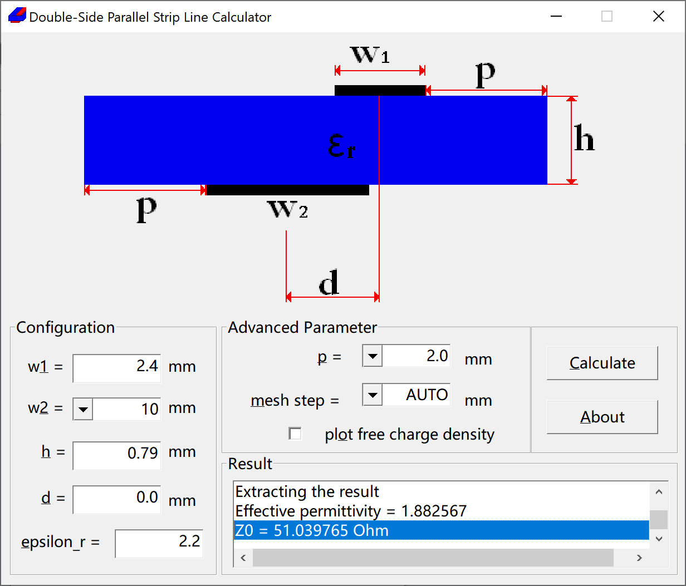

# DSPSL: Double-Side Parallel Strip Line Calculator

## Introduction
A program to calculate the wave / characteristic impedance of the first
(quasi-TEM) mode for the Double-Side Parallel Strip Line (DSPSL) Calculator.
Boundary Element Method (BEM) / Method of Moment (MoM) with Finite Volume
Element is used.

At the time of writing the first prototype (2012), my computer did not profit
from parallel computing, therefore OpenMP or threading is not included.

## Change Log
- 2016-08-17: Version 1.0 releases.
    - Port the code and build steps to the new compilers.
    - Port to x64.
    - Add License.
- 2012-05-06: Version 0.4 releases.
    - Fix buffer initialization bug.
- 2012-04-21: First working version.

## Building
Since it does not have any dependency than Win32APIs for the GUI, the build system consists of simple Makefiles and batch files.

### For Windows
The program can be built under GCC or Visual C++:
- Run the `build-msvc.bat` under Visual Studio command line.
- Run `build-mingw.bat` for a MingW build.

### For Linux / Unix
- `make` to generate a command line version of this program.
-  Linux native GUI also be built using libwine.

## Tests
This small program does not include unit tests. However, integration tests will be added in the later versions.

## License
It can be redistributed in either LGPL(v3+) or commercial license, further
information please contact the author.
